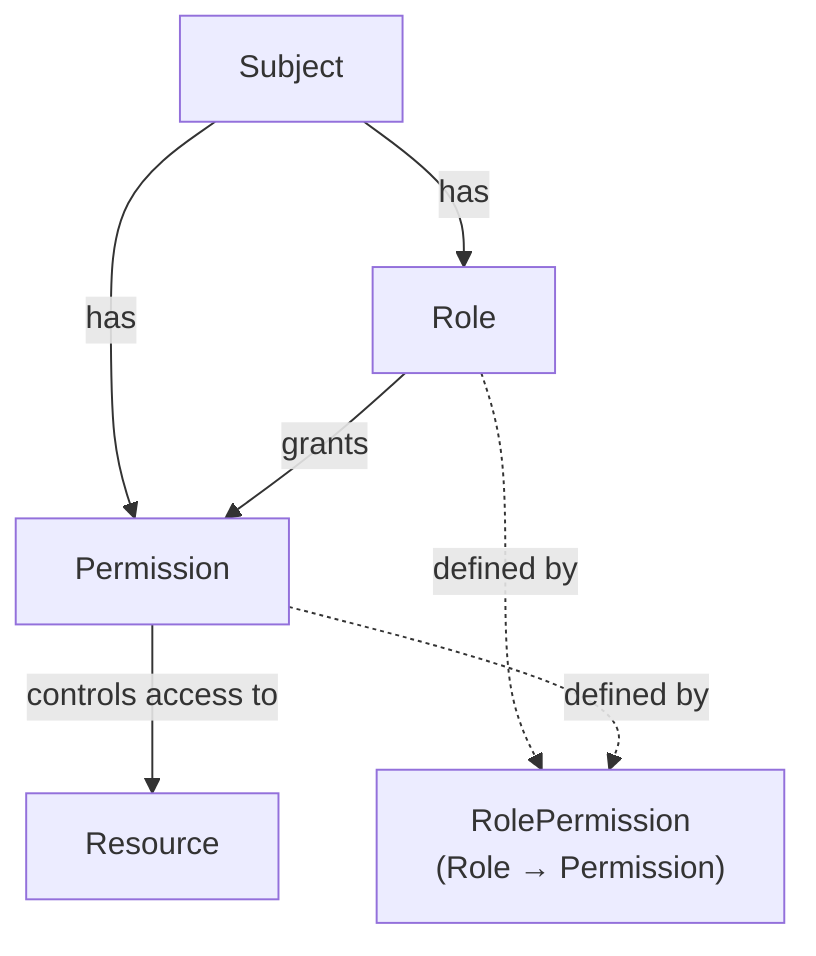

# Zanzibar

A demonstration of Google's Zanzibar system for fine-grained access control.

## Overview

Traditional Role-Based Access Control (RBAC) manages global permissions on resources but becomes limiting when sharing resources among users with controlled access patterns. For example: "Can X access Y, and can X access Z through Y?" This type of relational access is difficult to represent in traditional RBAC.

Zanzibar provides an elegant solution to these complex permission models. We draw inspiration from the work done by the community, particularly [SpiceDB](https://spicedb.com/), which is a fantastic resource worth exploring.

## Why Zanzibar Over Traditional RBAC?

Traditional RBAC can be stretched to handle relational permissions, but it requires complex workarounds. Zanzibar's relation-based approach natively supports these patterns, making it cleaner and more maintainable.

## Core Concepts

This form of relationship works globally to answer the question: "Can a subject access a resource globally?" Yes, but what if we need more control? We might want to forbid a user from accessing all resources or allow access to some. To demonstrate this, we can extend traditional RBAC by creating relationships where we register resources and map them to roles and subjects.

### Core Tables

#### Role Table

Defines global roles that can be assigned to subjects. Answers the question: "What roles exist in the system?"

| id | identifier | created_at | updated_at |
| --- | --- | --- | --- |
| uuid | Admin | timestamp | timestamp |
| uuid | Editor | timestamp | timestamp |

#### Permission Table

Defines granular permissions that control access to specific actions. Answers the question: "What permissions are available and what actions do they grant?"

| id | identifier | created_at | updated_at |
| --- | --- | --- | --- |
| uuid | admin.write | timestamp | timestamp |
| uuid | editor.read | timestamp | timestamp |

#### Role Permission Table

Maps roles to permissions, defining what actions each role can perform globally. Answers the question: "What permissions does a given role have?"

| role_id | permission_id | created_at | updated_at |
| --- | --- | --- | --- |
| uuid | uuid | timestamp | timestamp |

#### Subject Table

Represents users or entities that can be granted permissions and roles. Answers the question: "Who is this subject and when were they created?"

| id | identifier | created_at | updated_at |
| --- | --- | --- | --- |
| uuid | <user@example.com> | timestamp | timestamp |

#### Subject Role Table

Associates subjects with global roles, enabling role-based access at the system level. Answers the question: "What global roles does a subject have?"

| subject_id | role_id | created_at | updated_at |
| --- | --- | --- | --- |
| uuid | uuid | timestamp | timestamp |

#### Subject Permission Table

Grants specific permissions directly to subjects, bypassing role hierarchy when needed. Answers the question: "What direct permissions does a subject have outside of their roles?"

| subject_id | permission_id | created_at | updated_at |
| --- | --- | --- | --- |
| uuid | uuid | timestamp | timestamp |

#### Resource Table

Represents individual resources (servers, domains, files, etc.) that need fine-grained access control. Answers the question: "What resources exist, who created them, and what type are they?"

- **id**: Primary key uniquely identifying this resource
- **description**: Optional string explaining the purpose of this resource
- **resource_type**: The category of resource (e.g., server, domain, file, database)
- **resource_id**: The unique identifier of the actual resource being controlled
- **created_by**: The subject (user) who created this resource
- **created_at**: Timestamp when the resource was created
- **updated_at**: Timestamp when the resource was last modified

| id | description | resource_type | resource_id | created_by | created_at | updated_at |
| --- | --- | --- | --- | --- | --- | --- |
| uuid | Server Resource | server | uuid | uuid | timestamp | timestamp |

#### Resource Role

Maps subjects to roles for specific resources, enabling fine-grained resource-level access control. Answers the question: "Who has what role for this specific resource, and who granted that role?"

- **id**: Primary key uniquely identifying this role assignment
- **description**: Optional string explaining the purpose of this role assignment
- **resource_id**: References the specific resource this role applies to
- **role_id**: The role being assigned (owner, admin, user)
- **subject_id**: The subject receiving this role (Subject are User / Server ) yes Server cause sometimes a server would ask can i access this domain?
- **granted_by**: The subject who granted this role (must be a resource owner or admin)

| id | description | resource_id | role_id | subject_id | granted_by |
| --- | --- | --- | --- | --- | --- |
| uuid | Server Resource | uuid | uuid | user-uuid | uuid |
| uuid | Domain Resource | uuid | uuid | server-uuid | uuid |

## Access Control Through Relationships

With this system, we can answer the fundamental question: **"Can a subject access a resource?"** This represents a significant improvement over traditional RBAC by enabling nuanced, relationship-based access control.

**Example:** A subject gains access to a server by being assigned a role on that server. If that server is then granted access to a domain resource, the subject can transitively access the domain through the server. This creates a flexible hierarchy that adapts to complex organizational structures.
